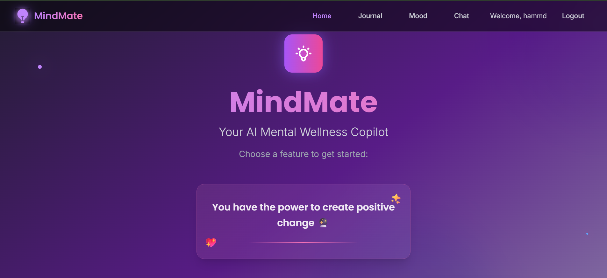
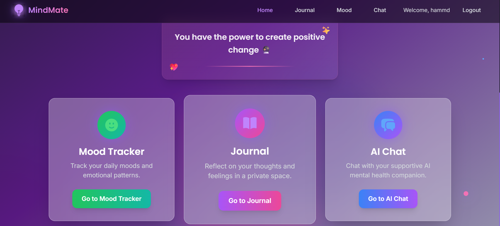
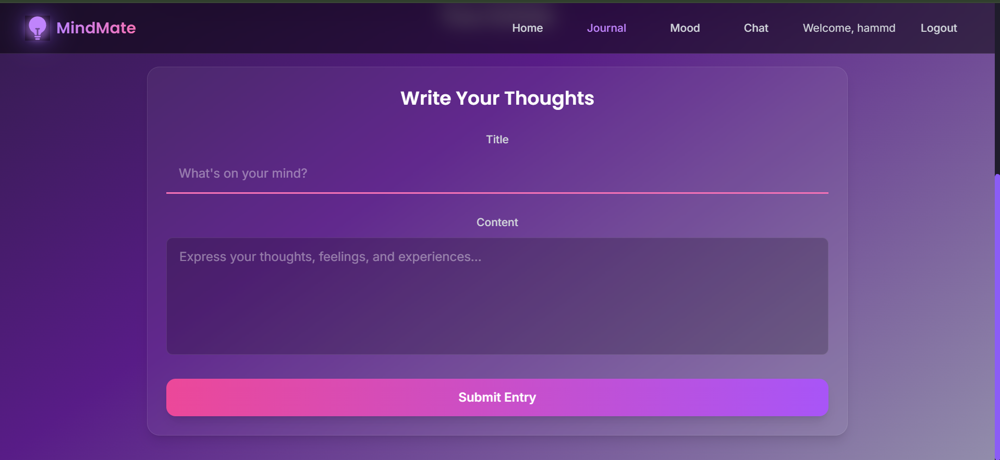
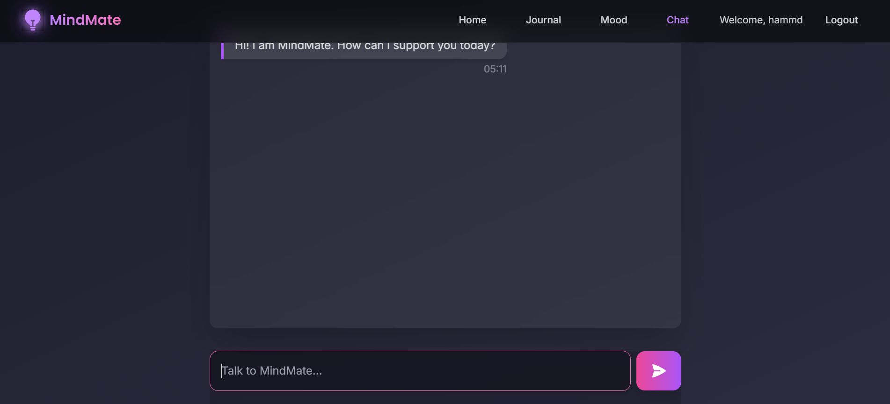
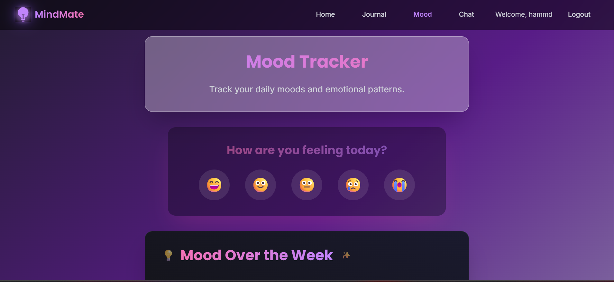

# 🧠 MindMate AI – Mental Health Copilot

MindMate AI is a fullstack AI-powered mental health journaling and mood-tracking app. It helps users anonymously track emotions, write journals, talk to a GPT-based assistant, and receive personalized affirmations — all inside a friendly dark UI.

---

## 🌟 Features

- 📝 AI-assisted journaling with sentiment analysis
- 📊 Mood tracker with daily logs and emotion history
- 💬 GPT-powered chat for emotional support
- 🧘 Affirmations and self-care suggestions
- 🔐 JWT-based login & registration system
- 🌙 Dark theme with modern UI

---

## 🧱 Tech Stack

**Frontend:**
- React + Vite
- Tailwind CSS
- React Router DOM

**Backend:**
- Node.js + Express
- MongoDB + Mongoose
- JWT + bcrypt (Auth)

**AI/Integrations:**
- OpenRouter API (Mistral/GPT)
- Twinword Sentiment API

---

## 📸 Screenshots

### 🏠 Home Page



### ✍️ Journal Entry


### 💬 GPT Chat Interface


### 📈 Mood Tracker Graph


---

## 🚀 Getting Started

### 1. Clone the Repo

```bash
git clone https://github.com/Hammad6966/mindmate-ai.git
cd mindmate-ai
